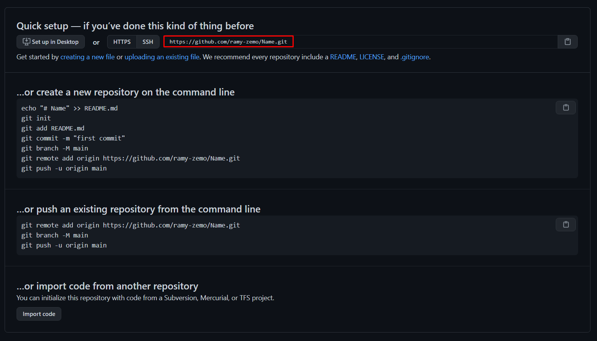

# GithubFakeCommiter
> This is a simple tool written in C# which fakes old commits.

## Usage
1. Create new Github Repository

2. Make Repository private

3. Copy Repository Link

4. Turn on private contributions

5. Start Git Commiter.exe

## Contact
Created by [@Ramy-Zemo](https://github.com/ramy-zemo)
Discord: Ramo#4907
